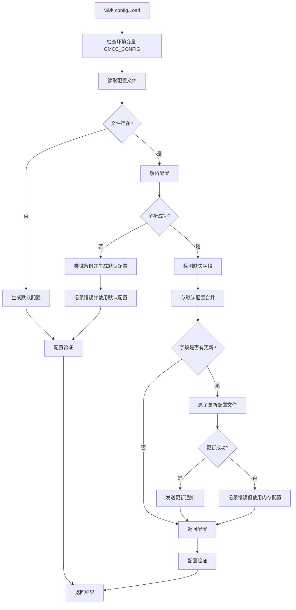

# 配置文件自动更新功能设计

## 概述

为 gmcc 项目添加配置文件自动更新功能，在程序启动时检测并补全缺失的配置项，保留用户自定义值，并根据运行模式提供适当的通知。

## 问题背景

当前 gmcc 项目使用 YAML 配置文件 `config.yaml` ，通过 `config.Load()` 函数加载配置。当项目添加新的配置项后，用户的现有配置文件可能缺少这些新字段，导致程序无法使用完整的配置功能。需要一种机制在启动时自动补全缺失的配置项。

## 设计目标

1. **自动补全**：启动时检测并补充缺失的配置项
2. **非破坏性**：保留用户现有配置值，仅填入缺失项
3. **适应性通知**：根据运行模式（TUI/Headless）提供不同通知方式
4. **向后兼容**：不破坏现有配置加载流程

## 架构设计

### 核心组件

#### 配置合并器 (ConfigMerger)

负责比较当前配置与默认配置，合并缺失字段：

- 使用反射遍历结构体字段
- 递归处理嵌套结构体
- 保留非零值，仅填入零值字段
- 记录添加的配置项路径

#### 通知系统 (Notification)

根据运行模式提供不同的通知方式：

- **TUI 模式**：在界面显示更新通知
- **Headless 模式**：输出结构化日志

### 启动流程



### 配置合并策略

#### 字段比较规则

1. **零值检测**：检测字段是否为零值（0, "", false, nil等）
2. **类型匹配**：确保新旧字段类型一致
3. **递归合并**：对结构体字段递归应用合并
4. **切片处理**：仅当切片为 nil 时使用默认值
5. **自定义标签**：通过 YAML 标签识别字段路径

#### 合并优先级

1. **现有值** > **默认值**（非零值时）
2. **用户配置** > **默认配置**（存在时）
3. **环境变量** > **文件配置**（当同时存在时）

#### 集成现有验证机制

```go
func LoadWithAutoUpdate(path string) (*Config, error) {
    cfg, err := Load(path)
    if err != nil {
        return nil, err
    }
    
    // 使用现有的 Validate 方法进行基础验证
    if err := cfg.Validate(); err != nil {
        return nil, err
    }
    
    // 检查是否需要更新
    if needsUpdate(cfg) {
        updatedCfg, changes, err := mergeWithDefaults(cfg)
        if err != nil {
            logx.Errorf("配置更新失败: %w", err)
            return cfg, nil // 返回原配置而不是错误
        }
        // 保存并通知
        if err := saveAndNotify(updatedCfg, changes, path); err != nil {
            logx.Errorf("保存更新配置失败: %w", err)
            return updatedCfg, nil // 返回内存中的配置
        }
        return updatedCfg, nil
    }
    return cfg, nil
}
```

### 错误处理策略

#### 错误分类与响应

1. **文件读取失败**
   - 处理：返回错误，终止加载
   - 日志：记录读取失败原因（使用 `logx.Errorf("读取配置文件失败: %w", err)` 格式）

2. **YAML 解析失败**
   - 处理：尝试备份原文件，返回错误
   - 日志：记录解析错误位置（使用 `logx.Errorf("解析配置文件失败: %w", err)` 格式）

3. **合并过程失败**
   - 处理：捕获反射 panic，记录错误，返回合并前的配置
   - 日志：记录合并失败详情（使用 `logx.Errorf("配置合并失败: %w", err)` 格式）

4. **配置文件写入失败**
   - 处理：返回内存中的配置，继续运行
   - 日志：记录写入失败原因（使用 `logx.Errorf("写入配置文件失败: %w", err)` 格式）

5. **临时文件创建失败**
   - 处理：跳过更新，使用原配置
   - 日志：记录临时文件创建失败

6. **磁盘空间不足**
   - 处理：跳过更新，使用原配置
   - 日志：记录磁盘空间不足

7. **文件权限问题**
   - 处理：检查并记录权限，跳过更新
   - 日志：记录权限问题详情

### 通知系统设计

#### 通知接口

```go
type ConfigChange struct {
    Path     string // 字段路径，如 "actions.delay_ms"
    OldValue any    // 原值（可能为空）
    NewValue any    // 新值
}

type UpdateNotifier interface {
    NotifyConfigUpdate(changes []ConfigChange) error
}
```

#### 实现策略

1. **TUI 模式实现**
   - 集成 i18n 系统，使用多语言通知文本
   - 在主界面显示短暂通知
   - 记录添加的具体字段
   - 提供查看详情选项

2. **Headless 模式实现**
   - 使用 logx 系统记录结构化日志
   - 集成 i18n 系统输出多语言日志
   - 记录添加的配置项路径
   - 包含时间戳和操作结果

#### 集成现有系统

```go
type TUIUpdateNotifier struct{}
func (n *TUIUpdateNotifier) NotifyConfigUpdate(changes []ConfigChange) error {
    i18n := i18n.GetI18n()
    // 使用 i18n 系统显示通知
    message := i18n.Translate("config.updated", len(changes))
    // TUI 界面显示实现
}

type HeadlessUpdateNotifier struct{}
func (n *HeadlessUpdateNotifier) NotifyConfigUpdate(changes []ConfigChange) error {
    i18n := i18n.GetI18n()
    // 使用 logx 系统记录通知
    logx.Infof(i18n.Translate("config.updated", len(changes)))
    for _, change := range changes {
        logx.Infof(i18n.Translate("config.field.added", change.Path, change.NewValue))
    }
}
```

## 测试计划

### 单元测试

1. **配置合并器测试**
   - 测试基础类型字段合并
   - 测试嵌套结构体合并
   - 测试零值检测逻辑
   - 测试切片字段处理
   - 测试自定义 YAML 标签处理

2. **通知系统测试**
   - 测试 TUI 模式通知
   - 测试 Headless 模式日志
   - 测试多语言通知内容（使用 i18n 系统）

3. **原子文件操作测试**
   - 测试文件成功更新
   - 测试备份创建
   - 测试失败回滚
   - 测试并发安全

### 集成测试

1. **完整加载流程测试**
   - 测试存在配置文件的更新
   - 测试不存在配置文件的处理
   - 测试损坏配置文件的恢复

2. **运行模式适配测试**
   - 测试 TUI 模式下的通知
   - 测试 Headless 模式下的日志记录

### 边界测试

1. **异常配置文件测试**
   - 部分字段损坏的配置
   - 结构不匹配的配置
   - 权限问题导致无法写入
   - 只读文件系统环境
   - 磁盘空间不足环境
   - 并发访问测试

2. **大规模配置变更测试**
   - 新增多个嵌套结构体
   - 复杂字段类型变更
   - 配置结构大幅调整

3. **配置版本迁移测试**
   - 从旧版本配置迁移到新版本
   - 处理已弃用的配置字段
   - 测试配置重大变更的兼容性

## 实现细节

### 文件结构

```
internal/config/
    ├── config.go          # 配置结构体定义
    ├── loader.go          # 配置加载逻辑 (修改)
    ├── merger.go          # 配置合并器 (新增)
    └── notifier.go        # 通知系统 (新增)

文件修改说明:
- loader.go: 添加 LoadWithAutoUpdate 函数，集成现有 Load 函数
- 新增文件: 保持与项目现有代码风格一致
```

### 关键函数

#### loader.go 增强功能

```go
func LoadWithAutoUpdate(path string) (*Config, error)
// 扩展现有 Load 函数，增加自动更新功能

func (m *ConfigMerger) MergeWithDefault(current *Config) (*Config, []ConfigChange, error)
// 执行配置合并逻辑，返回配置和变更记录

// 与现有的 Load 函数集成，保持向后兼容
func Load(path string) (*Config, error) {
    cfg, err := LoadWithAutoUpdate(path)
    if err != nil {
        return nil, err
    }
    return cfg, nil
}
```

#### 原子文件操作

```go
func atomicUpdate(path string, data []byte) error {
    // 创建临时文件
    tmpPath := path + ".tmp." + time.Now().Format("20060102150405")
    if err := os.WriteFile(tmpPath, data, 0644); err != nil {
        return fmt.Errorf("创建临时文件失败: %w", err)
    }
    
    // 备份原文件
    if _, err := os.Stat(path); err == nil {
        backupPath := path + ".backup." + time.Now().Format("20060102150405")
        if err := os.Rename(path, backupPath); err != nil {
            os.Remove(tmpPath)
            return fmt.Errorf("备份原文件失败: %w", err)
        }
    }
    
    // 原子重命名
    if err := os.Rename(tmpPath, path); err != nil {
        return fmt.Errorf("原子更新失败: %w", err)
    }
    
    return nil
}
```

### 版本兼容性

为了未来可能的配置版本管理，设计考虑：

1. **版本字段集成**：
```go
type Config struct {
    Version string `yaml:"version"` // 配置版本号
    Account AccountConfig `yaml:"account"`
    // 其他字段...
}
```

2. **变更记录**：记录配置变更历史（保存到 .config_changes 文件）
3. **迁移路径**：
```go
type ConfigMigrator interface {
    Migrate(cfg *Config, fromVer, toVer string) error
}
```

4. **环境变量集成**：与现有 GMCC_CONFIG 环境变量无缝集成，不影响现有配置路径逻辑

## 性能考虑

1. **反射开销**：启动时一次性使用，可接受
2. **文件 I/O**：仅在配置有变更时写入
3. **内存占用**：临时构建默认配置，完成后释放

## 安全考虑

1. **配置文件备份**：修改前自动备份，使用时间戳命名（如 config.yaml.backup.20260328123456）
2. **权限检查**：确保有足够权限读写配置文件，避免权限错误的静默失败
3. **数据验证**：合并后执行完整配置验证，确保结果符合预期
4. **原子操作**：使用临时文件+重命名实现原子更新，避免部分写入导致的配置损坏
5. **反射安全**：捕获并处理反射操作可能的 panic，确保程序稳定性

## 扩展性

1. **自定义合并策略**：可扩展特定字段的合并逻辑
2. **插件式通知**：可扩展通知机制
3. **配置模板系统**：便于未来支持不同配置模板

## 总结

本设计提供了一个轻量级、非破坏性的配置自动更新方案，通过扩展现有加载器实现配置智能补全，同时根据运行模式提供适当的通知。方案保持了向后兼容性，不影响现有代码正常运行，并为未来的配置版本管理预留了扩展空间。